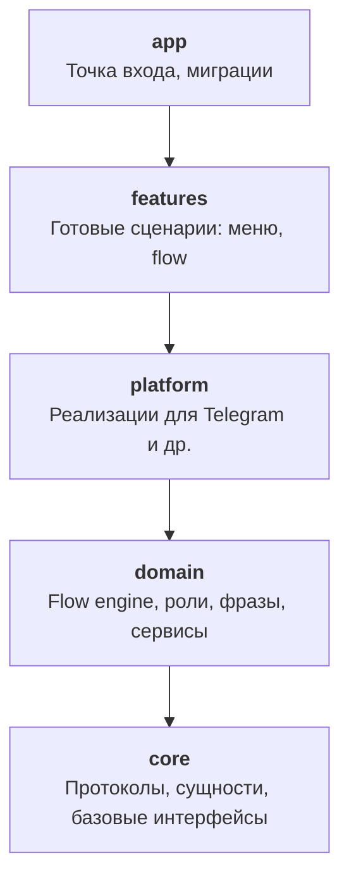
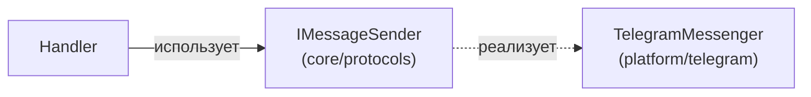

# Архитектура

Bot Framework построен на принципах Clean Architecture. Зависимости направлены строго сверху вниз — верхние слои знают о нижних, но не наоборот.

## Слои



| Слой | Содержимое | Зависит от |
|------|-----------|------------|
| **core** | Протоколы (`I`-интерфейсы), Pydantic-сущности | Ничего |
| **domain** | Flow engine, роли, фразы, декораторы | core |
| **platform** | Telegram messenger, middleware, реестры | domain, core |
| **features** | Готовые меню, встроенные flow | platform, domain, core |
| **app** | `BotApplication`, миграции БД | Все слои |

!!! note "Контроль импортов"
    Нарушения направления зависимостей обнаруживаются автоматически через `import-linter`. Команда `lint-imports` проверяет, что нижние слои не импортируют из верхних.

## Принцип протоколов

Все межслойные зависимости описаны через Protocol-интерфейсы с префиксом `I`. Реализации находятся в отдельных модулях:



Это позволяет:

- Менять платформу без изменения бизнес-логики
- Тестировать компоненты изолированно через моки
- Добавлять новые платформы, реализуя существующие протоколы

## Структура каталогов

```
bot_framework/
├── app/              # BotApplication, миграции
├── features/         # Готовые меню и flow
│   ├── menus/        #   Стартовое меню, главное меню
│   └── flows/        #   Запрос роли и др.
├── platform/         # Платформенные реализации
│   └── telegram/     #   Messenger, middleware, реестры
├── domain/           # Бизнес-логика
│   ├── flow_management/    # Flow engine, flow stack
│   ├── role_management/    # Роли и права
│   ├── language_management/# Фразы
│   ├── services/           # Утилиты
│   └── decorators/         # check_roles
└── core/             # Фундамент
    ├── protocols/    #   I-интерфейсы
    ├── entities/     #   Pydantic-модели
    └── base_protocols/ # Базовые CRUD
```
