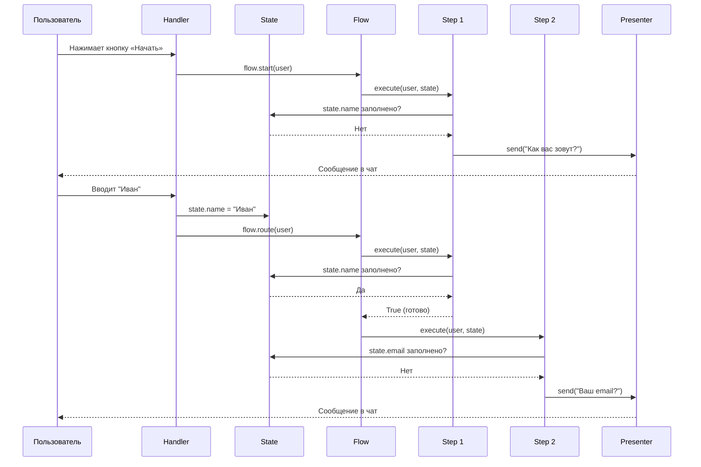
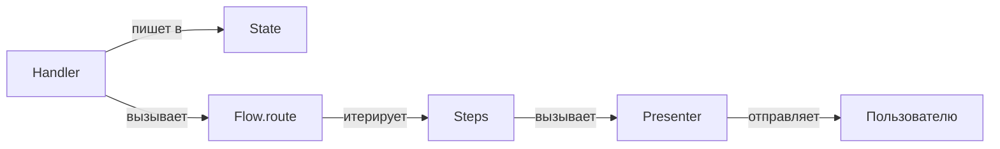
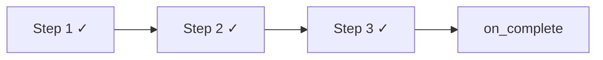

# Жизненный цикл Flow

Flow — это линейная цепочка шагов, которую проходит пользователь в диалоге с ботом. Каждый шаг собирает одну единицу данных.

## Участники

| Участник | Роль |
|----------|------|
| **Handler** | Принимает ввод от пользователя, записывает данные в State |
| **Flow** | Хранит список шагов, итерирует их по порядку |
| **Step** | Проверяет одно поле в State. Если пусто — вызывает Presenter |
| **Presenter** | Формирует и отправляет сообщение пользователю |
| **State** | Pydantic-модель с данными, собранными в процессе flow |

## Процесс



## Принцип разделения ответственности



Ключевые правила:

- **Handler не знает о Presenter** — он только записывает данные и передаёт управление Flow
- **Step не знает о Handler** — он только проверяет State и вызывает Presenter
- **Presenter не знает о Step и Flow** — он только формирует и отправляет сообщение
- **Flow не знает о содержимом шагов** — он только вызывает их по порядку

## Завершение Flow

Когда все шаги вернули `True` (все поля State заполнены), Flow вызывает callback `on_complete`. Обычно это финальный Presenter, который показывает подтверждение.



## Типичная структура файлов Flow

```
src/flows/my_flow/
├── factory.py            # Сборка зависимостей
├── handlers/             # Обработчики ввода
├── steps/                # Шаги flow
├── presenters/           # Отправка сообщений
├── entities/             # State (Pydantic-модель)
└── repos/                # Хранилище state
```

!!! info "Подробнее"
    Полный пример создания flow с кодом — в разделе [Создание Flow](../examples/creating-flow.md).
