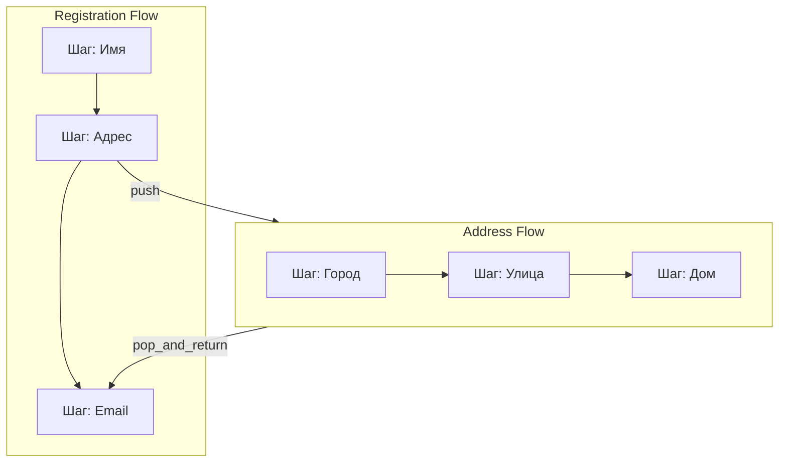
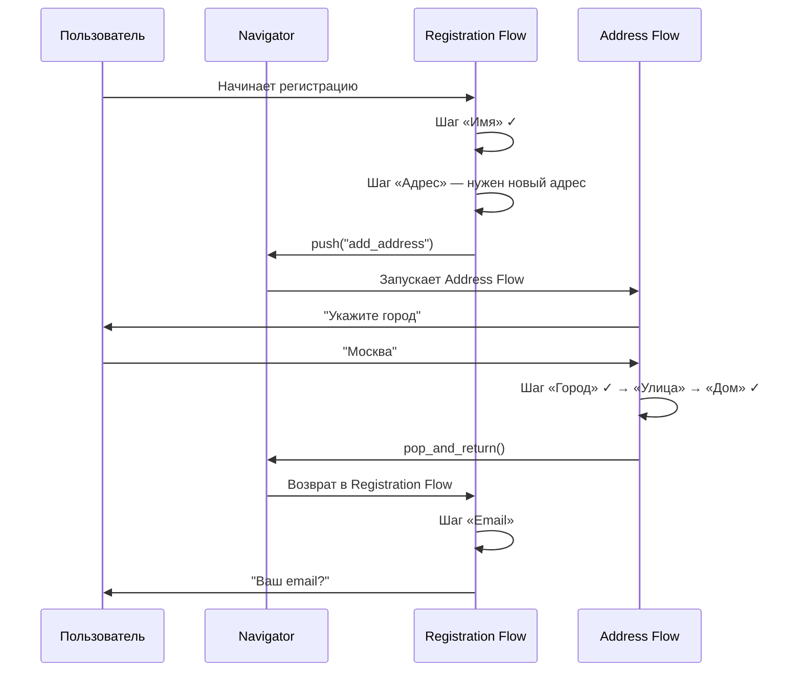

# Flow Stack

Один Flow — линейная цепочка шагов без ветвлений. Но иногда внутри flow требуется ответвление: например, при заполнении адреса нужно пройти отдельную цепочку «город → улица → дом».

Flow Stack решает эту задачу — он соединяет несколько flow с возможностью возврата.

## Как это работает

Flow Stack работает как **стек вызовов функций**:

| Операция | Аналогия | Что происходит |
|----------|----------|---------------|
| `push` | Вызов функции | Текущий flow приостанавливается, запускается дочерний |
| `pop_and_return` | Возврат из функции | Дочерний flow завершается, управление возвращается родительскому |
| `terminate` | Выход без возврата | Текущий flow завершается, стек не раскручивается |
| `clear_all` | Сброс | Весь стек очищается (например, при `/start`) |

## Процесс навигации

## Правило

- **Один flow = одна линейная цепочка** без ветвлений
- Как только появляется ответвление — выносить его в отдельный flow
- Flow Stack соединяет flow между собой

## Компоненты

| Компонент | Назначение |
|-----------|-----------|
| **FlowRegistry** | Реестр всех flow по имени |
| **FlowStackNavigator** | Управление стеком: push, pop, terminate, clear |
| **RedisFlowStackStorage** | Хранение стека в Redis |

!!! info "Подробнее"
    Пример использования API Flow Stack — в [README проекта](https://github.com/sumarokov-vp/bot-framework).
