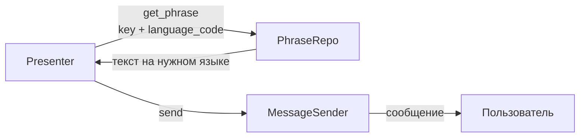

# Мультиязычность

Bot Framework поддерживает отправку сообщений на языке пользователя. Фразы хранятся в JSON-файле и загружаются при старте.

## Общая схема

## Как это работает

1. Каждая фраза хранится по ключу (например, `"registration.ask_name"`) с переводами на все языки
2. Presenter запрашивает фразу через `PhraseRepo`, передавая ключ и код языка пользователя
3. `PhraseRepo` возвращает текст на нужном языке
4. Если перевод для языка не найден — возвращается текст на языке по умолчанию

## Компоненты

| Компонент | Назначение |
|-----------|-----------|
| **PhraseRepo** | Поиск фразы по ключу и языку |
| **LanguageRepo** | Управление доступными языками |

## Формат файла фраз

Фразы определяются в `data/phrases.json`. Подробный формат — в разделе [Конфигурация](../examples/configuration.md).
