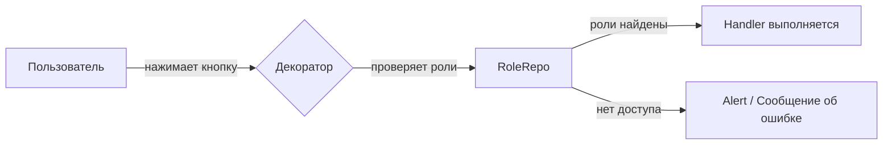
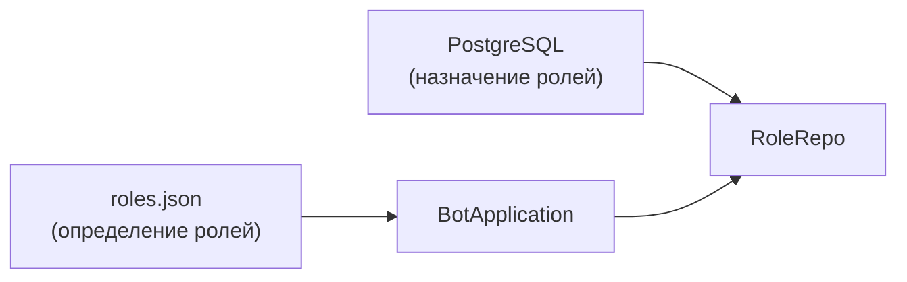

# Роли и доступ

Система ролей позволяет ограничивать доступ к обработчикам. Каждый пользователь может иметь одну или несколько ролей.

## Общая схема

## Как работает проверка

1. Пользователь вызывает обработчик (нажимает кнопку или отправляет сообщение)
2. Декоратор перехватывает вызов и запрашивает роли пользователя из `RoleRepo`
3. Если у пользователя есть хотя бы одна из `allowed_roles` — обработчик выполняется
4. Если нет — показывается alert (для callback) или сообщение об ошибке (для message)
5. Если `allowed_roles = None` — доступ открыт всем

## Два типа декораторов

| Декоратор | Тип обработчика | Обратная связь при отказе |
|-----------|----------------|--------------------------|
| `@check_roles` | Callback (нажатие кнопки) | Alert через `callback_answerer` |
| `@check_message_roles` | Message (текстовое сообщение) | Сообщение через `message_sender` |

## Требования к обработчику

Чтобы декоратор работал, класс обработчика должен содержать:

| Атрибут | Обязательный | Назначение |
|---------|:---:|-----------|
| `role_repo` | Да | Источник ролей пользователя |
| `allowed_roles` | Да | Набор допустимых ролей (`None` = все) |
| `callback_answerer` | Нет | Показ alert при отказе (для `@check_roles`) |
| `message_sender` | Нет | Отправка сообщения при отказе (для `@check_message_roles`) |

## Хранение ролей

Роли определяются в файле `data/roles.json` и загружаются при старте приложения. Назначение ролей пользователям хранится в PostgreSQL.

!!! info "Подробнее"
    Формат файла ролей — в разделе [Конфигурация](../examples/configuration.md). Примеры кода декораторов — в разделе [Декораторы](../reference/decorators.md).
