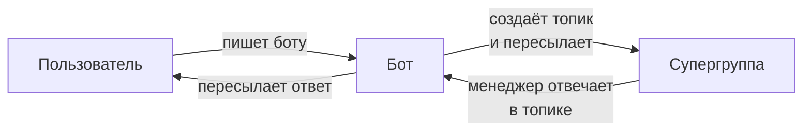

# Support Chat

Support Chat зеркалирует переписку пользователя с ботом в Telegram-супергруппу с топиками. Каждому пользователю создаётся отдельный топик.

## Общая схема

## Как это работает

1. Пользователь пишет боту
2. Бот проверяет, есть ли топик для этого пользователя в супергруппе
3. Если топика нет — создаёт новый с именем пользователя
4. Сообщение пересылается в топик
5. Менеджер отвечает прямо в топике
6. Бот пересылает ответ менеджера пользователю

## Требования

| Требование | Описание |
|-----------|----------|
| Супергруппа | Telegram-группа с включёнными Topics |
| Права бота | Администратор с правом «Manage Topics» |
| `support_chat_id` | ID супергруппы (начинается с `-100`) |

## Подключение

Support Chat включается передачей `support_chat_id` при создании `BotApplication`. Подробнее — в [Создании Flow](../examples/creating-flow.md).
